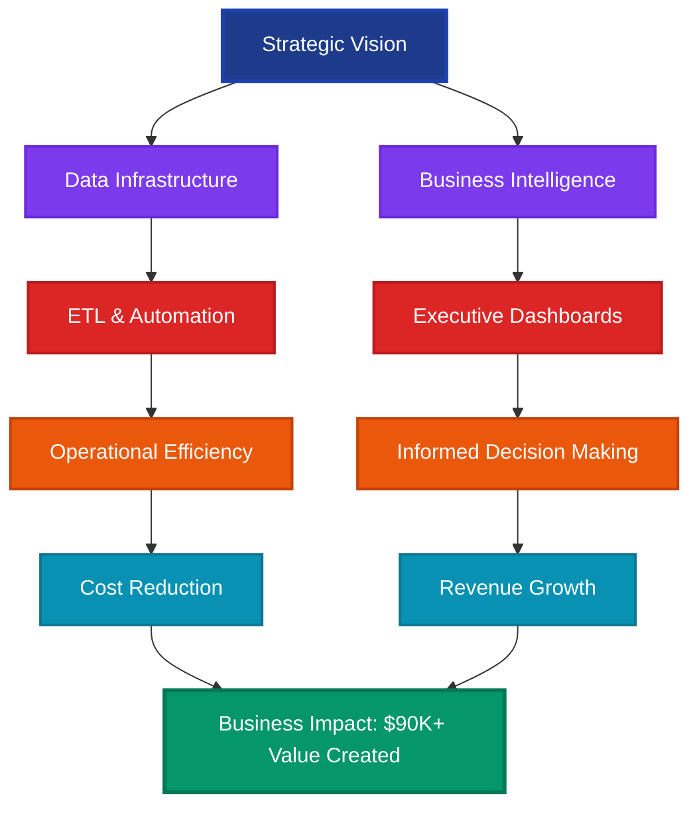
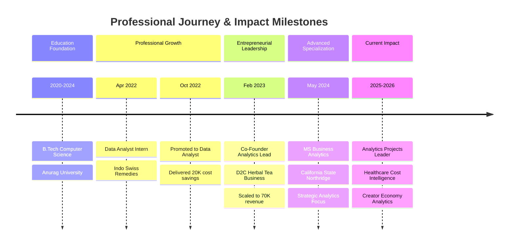
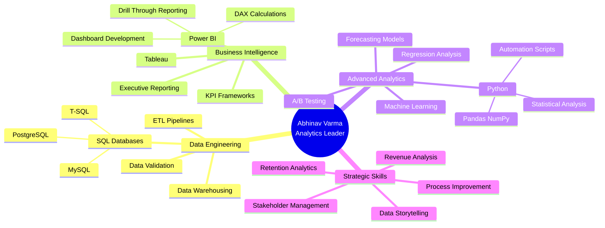

---

## 🎯 EXECUTIVE SUMMARY

**Strategic Analytics Leader** with proven track record of driving business value through data-driven decision-making and operational excellence. Currently pursuing MS in Business Analytics at California State University, Northridge, while bringing **2+ years of professional experience** delivering measurable impact across pharmaceutical manufacturing and D2C e-commerce sectors.

**Core Competencies:** Business Intelligence Architecture • Predictive Analytics • Revenue Optimization • Process Automation • Cross-Functional Leadership • Stakeholder Management

---

## 📊 EXECUTIVE DASHBOARD

| **METRIC** | **IMPACT** | **DOMAIN** |
|:---:|:---:|:---:|
| **Revenue Generated** | $70K+ | D2C E-Commerce |
| **Cost Savings Delivered** | $20K+ | Supply Chain Optimization |
| **Operational Efficiency** | 15+ hrs/month saved | Reporting Automation |
| **Forecast Accuracy Improvement** | +12% | Pharmaceutical Analytics |
| **Repeat Purchase Growth** | +40% | Customer Retention Strategy |
| **Inventory Optimization** | -18% stockouts | Demand Forecasting |
| **Data Quality Enhancement** | -22% reporting errors | Process Standardization |
| **Business Growth (QoQ)** | +32% | Strategic Analytics |

---

## 💼 LEADERSHIP PHILOSOPHY

> *"Transforming complex data ecosystems into strategic assets that drive measurable business outcomes. I believe in empowering organizations through actionable intelligence, automated workflows, and scalable analytics infrastructure that bridges the gap between technical capability and executive decision-making."*

My approach centers on three pillars:
- **Strategic Alignment**: Ensuring analytics initiatives directly support business objectives and revenue goals
- **Operational Excellence**: Building scalable, automated systems that free teams to focus on high-value analysis
- **Stakeholder Empowerment**: Delivering intuitive dashboards and insights that enable confident, data-driven decisions at all levels

---

## 🚀 STRATEGIC IMPACT FRAMEWORK

---

## 📈 CAREER PROGRESSION TIMELINE

---

## 🏆 KEY ACHIEVEMENTS & BUSINESS IMPACT

### **Indo Swiss Remedies Pvt Ltd** | Data Analyst (Promoted from Intern)
**Apr 2022 – May 2024 | Pharmaceutical Manufacturing**

#### **Strategic Initiatives Led:**

**1. Supply Chain Optimization & Forecasting Excellence**
- Architected predictive forecasting models across 60+ pharmaceutical product lines, achieving **12% improvement in forecast accuracy**
- Partnered with supply chain leadership to implement data-driven inventory strategies, reducing stockouts by **18%**
- **Financial Impact**: Generated **$20,000 in warehousing cost savings** through optimized inventory management

**2. Executive Business Intelligence Platform**
- Designed and deployed executive-facing Power BI dashboards with drill-through capabilities serving 10+ sales regions
- Replaced legacy manual spreadsheet processes, improving performance visibility and saving **15+ hours monthly**
- Enabled real-time KPI monitoring for C-suite decision-making across multi-region operations

**3. Data Quality & Process Automation Leadership**
- Engineered Python-based validation workflows automating 20+ recurring reports
- Reduced reporting inaccuracies by **15%** while freeing **6+ analyst hours weekly** for strategic analysis
- Standardized data validation protocols across 60+ product lines, cutting downstream errors by **22%**

**4. Revenue & Performance Analytics**
- Queried and analyzed complex sales data using advanced SQL to identify underperforming business segments
- Provided actionable insights that informed strategic resource allocation and product line decisions
- Delivered comprehensive performance analytics supporting executive planning and forecasting

---

### **Butterfly Pea Flower Herbal Tea Business** | Co-Founder & Analytics Lead
**Feb 2023 – Jul 2024 | D2C E-Commerce**

#### **Business Leadership & Strategic Impact:**

**1. Revenue Growth & Business Scaling**
- Led analytics strategy that contributed to scaling business to **$70K in revenue**
- Achieved **32% quarter-over-quarter growth** through data-driven acquisition and retention strategies
- Developed comprehensive performance tracking across acquisition, retention, and sales funnel metrics

**2. Business Intelligence Architecture**
- Built integrated Power BI dashboards connecting Shopify sales and customer data for real-time business monitoring
- Created executive-ready KPI dashboards for investor presentations and strategic planning
- Enabled data-driven inventory planning and marketing budget allocation decisions

**3. Customer Retention & Revenue Optimization**
- Identified critical repeat-purchase gaps through advanced customer behavior analysis
- Implemented automated WhatsApp engagement workflows increasing repeat sales by **40%**
- Reduced COD (Cash on Delivery) and RTO (Return to Origin) losses through predictive analytics

**4. Strategic Analytics & Business Planning**
- Evaluated product performance, channel effectiveness, and customer retention trends
- Guided inventory planning, marketing allocation, and customer lifecycle strategy
- Delivered actionable insights supporting quarterly business reviews and growth planning

---

## 🎓 STRATEGIC PROJECTS & INITIATIVES

### **Creator Economy & Algorithmic Performance Analytics**
**Advanced Regression Modeling | Statistical Analysis**

- Analyzed **2,467 promotional posts** across **800 influencers** to quantify creator authority impact on algorithmic amplification
- Built interaction-based regression model with statistically significant results measuring how early engagement signals drive downstream performance
- Engineered normalized efficiency KPIs (CTR, clicks per 1K reach, saves per 1K reach) uncovering scale-efficiency tradeoffs
- **Business Impact**: Informed creator selection strategy and paid-boost optimization for marketing teams

---

### **Healthcare Cost & Pricing Intelligence Platform**
**Data Engineering | PostgreSQL | Business Intelligence**

- Engineered comprehensive PostgreSQL data pipeline processing **200+ hospital datasets**
- Standardized disparate data sources into unified 24-column reporting model covering **100K+ payer-procedure combinations**
- Improved data quality by **15%** through systematic validation and normalization processes
- Developed executive Power BI dashboards visualizing insurer-level price variation for strategic decision-support
- **Strategic Value**: Simplified healthcare pricing analysis enabling data-driven contract negotiations

---

### **E-Commerce Revenue Forecasting & Demand Analytics**
**Predictive Modeling | Business Planning | Power BI**

- Examined **100K+ orders** representing **$15.4M in revenue** to identify seasonality trends and demand patterns
- Uncovered revenue concentration insights and demand variability supporting strategic business planning
- Built comprehensive Power BI dashboard with integrated forecasting model
- **Operational Impact**: Supported inventory planning, revenue analysis, and demand forecasting for e-commerce operations

---

## 💡 TECHNICAL EXPERTISE & ANALYTICS STACK

---

### **Core Technical Competencies**

| **CATEGORY** | **TECHNOLOGIES & SKILLS** |
|:---|:---|
| **Data Analysis & Programming** | Python • SQL (MySQL, PostgreSQL, T-SQL) • DAX • Advanced Excel |
| **Business Intelligence** | Power BI (Advanced) • Tableau • Dashboard Architecture • KPI Design |
| **Analytics Methodologies** | Forecasting • Statistical Analysis • Regression • A/B Testing • Cohort Analysis |
| **Data Engineering** | ETL Pipelines • Data Warehousing • Data Validation • Process Automation |
| **Business Strategy** | Revenue Analysis • Retention Strategy • Process Optimization • Stakeholder Reporting |
| **Tools & Platforms** | Git • Jupyter Notebook • Shopify Analytics • Real-time Monitoring Systems |

---

## 📚 FEATURED PROJECTS & REPOSITORIES

---

### **Healthcare Data Analysis using Power BI**
**Advanced BI | DAX | Data Modeling**

Interactive Power BI dashboard revealing key trends in hospital visitor data for strategic decision-making. Utilized DAX for deep insights into patient demographics and service usage patterns.

**Key Features:**
- Comprehensive data preprocessing and ETL in Power Query Editor
- Advanced DAX calculations for sophisticated data modeling
- Visit trend analysis (daily, monthly, quarterly, yearly patterns)
- Demographic insights and satisfaction score distribution
- Department referral analysis and wait time optimization insights

**Business Impact:** Enhanced operational efficiency and patient satisfaction through data-driven resource optimization

---

### **Supply Chain Analysis - FMCG Domain (AtliQ Mart)**
**Supply Chain Analytics | KPI Tracking | Service Level Management**

Comprehensive Power BI solution tracking On-time (OT%), In-full (IF%), and On-time-in-full (OTIF%) delivery metrics for FMCG manufacturer expansion strategy.

**Strategic Objectives:**
- Track daily service level performance across all customers
- Identify root causes of contract non-renewals
- Enable swift response to service issues before market expansion

**Analytical Insights Delivered:**
- Performance gap analysis against target metrics
- Line fill rate optimization recommendations
- Late delivery pattern identification (40% late orders, avg 2-day delay)
- Category-wise demand analysis and supplier performance evaluation

---

### **Stock Market Dashboard - Real-Time Analytics**
**Financial Analytics | Real-Time Data | Power BI**

Real-time stock market dashboard visualizing historical performance using area graphs and bar charts. Integrates financial APIs for live data streaming.

**Technical Implementation:**
- Financial API integration for real-time data acquisition
- Historical performance visualization (5-year trend analysis)
- Automated dashboard refresh and data pipeline
- Interactive filtering and drill-down capabilities

---

### **Cohort Analysis with Python**
**Retention Analytics | Customer Lifecycle | Business Intelligence**

Python-based cohort analysis framework adapted for modern data environments including Elasticsearch integration. Tracks user groups over time to understand retention patterns.

**Analytical Framework:**
- Cohort definition and segmentation methodology
- Time-based cohort tracking and visualization
- User retention heatmaps and trend analysis
- Revenue retention analysis by cohort group

**Business Applications:** Customer lifetime value estimation, churn prediction, product-market fit assessment

---

## 🎯 PROFESSIONAL DEVELOPMENT & CONTINUOUS LEARNING

### **Academic Excellence**

**Master of Science in Business Analytics** | California State University, Northridge
*May 2024 – May 2026*
- Advanced coursework in predictive modeling, data mining, and business intelligence
- Focus on strategic analytics applications in healthcare, retail, and e-commerce sectors
- Hands-on projects delivering real-world business impact

**Bachelor of Technology in Computer Science** | Anurag University
*June 2020 – June 2024*
- Strong foundation in programming, algorithms, and data structures
- Specialized coursework in database management and statistical analysis

---

### **Certifications & Specialized Training**

- **Advanced Power BI**: DAX, Data Modeling, Dashboard Architecture
- **SQL Mastery**: MySQL, PostgreSQL, T-SQL optimization
- **Python for Data Analysis**: Pandas, NumPy, Statistical Libraries
- **Business Intelligence Strategy**: KPI frameworks, Executive Reporting

---

## 🤝 MENTORSHIP & KNOWLEDGE SHARING

### **Technical Leadership Approach**

Throughout my career, I've prioritized knowledge transfer and team